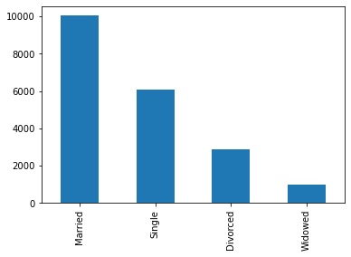
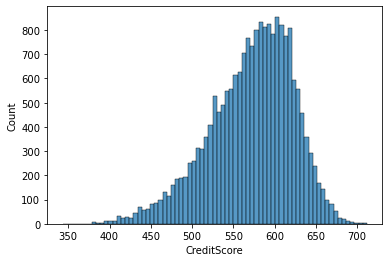

# Exploratory Data Analysis of Loan Application Data
## Introduction
This EDA is to explore the loan application data to see patterns of loan applicants.

## Data
This dataset was gotten from Kaggle. It contains 3000 rows and 20 columns. It is a loan application dataset that contains information about lenders':

**Personal information:** Age, Marital Status, Education Level, Employment Status, Job Tenure

**Financial status:** Annual Income, Monthly Income, Total Assets, Total Liabilities, Net Worth

**Credit behavior:** Credit Score, Credit Card Utilization, Debt-to-Income Ratio, Number of Credit Lines

**Loan details:** Loan Amount, Duration, Purpose, Interest Rate, Base Interest Rate

**Behavioral history:** Payment History, Bankruptcy History, Previous Defaults, Utility Bills Payment History

I read in the dataset using:
```
import pandas as pd

de = pd.read_excel('Loan.xlsx')
de.head()
```

## Data Cleaning
I performed a data quality check to ensure it is clean and ready for analysis. These were the data issues I found and rectified
1. **Missing Values:**

I used: ```de.isnull().sum()``` to find the columns that had missing values and the total number of missing values. I found them in the following columns:
```
staff_id      0
staff_name    1
age           6
gender        0
join_date     0
currency      5
salary        5
state         4
dept_id       0
dept_name     0
d_o_b         0
dtype: int64
```
I rectified the missing rows in the age column by extracting the year from the D.O.B column and subtracting it from the current year (2025).
```
workers['year'] = workers['d_o_b'].dt.year
workers.loc[workers['age'].isnull(), 'age'] = 2025 - workers['year']
```

2. **Datatypes:**

## Univariate Analysis & Insights
### Categorical Variables
These are the categorical columns I performed univariate analysis on: Marital Status, etc.

I did a frequency count for the Marital Status column using:
```
import matplotlib.pyplot as plt
import seaborn as sns

de['MaritalStatus'].value_counts()
```
**Result:**
```
Married     10041
Single       6078
Divorced     2882
Widowed       999
Name: MaritalStatus, dtype: int64
```
### Visualization
**Bar Chart:**
```
de['MaritalStatus'].value_counts().plot(kind='bar')
plt.show()
```
**Result:**



**Insight:**

Married couples make up the most loan applicants with 10,000 applications. While widowed people have the least applications. 

### Numerical Variable
These are the numerical columns I performed univariate analysis on: Annual Income, etc.

I found the measure of central tendency for the Annual Income column using:
```
mean = de['AnnualIncome'].mean()
median = de['AnnualIncome'].median()
mode = de['AnnualIncome'].mode()

print('mean =',mean)
print('median =',median)
print('mode =',mode)
```

**Result:**
```
mean = 59161.47355
median = 48566.0
mode = 0    15000
dtype: int64
```

### Visualization
**Histogram:**

```
sns.histplot(de['AnnualIncome'], bins = 10)
plt.show()
```
**Result:**


**Insight:**
Because the column is skewed I used the median as my average. On average, each applicant earns a yearly salary of $48,566. Majority of the applicants earn $15,000 yearly.

## Bivariate Analysis & Insights
### Categorical & Categorical Variables
These are the categorical columns I performed univariate analysis on: Education Level, Employment Status, etc.

I used cross tabulation to find the relationship between the Education Level & Employment Status columns using:
```
pd.crosstab(de['EmploymentStatus'], de['EducationLevel'])
```
**Result:**
```
EducationLevel	Associate	Bachelor	Doctorate	High School	Master
EmploymentStatus					
Employed	3500	5045	750	5283	2458
Self-Employed	262	575	111	315	310
Unemployed	272	434	93	310	282
```
**Visualization:**
**Clustered Bar Chart:**
```
pd.crosstab(de['EmploymentStatus'], de['EducationLevel']).plot(kind='bar')
plt.show()
```
**Result:**
)

**Insight:**

The education level that have the highest number of employed people is High School. While the least is Doctorate.

## Conclusion

